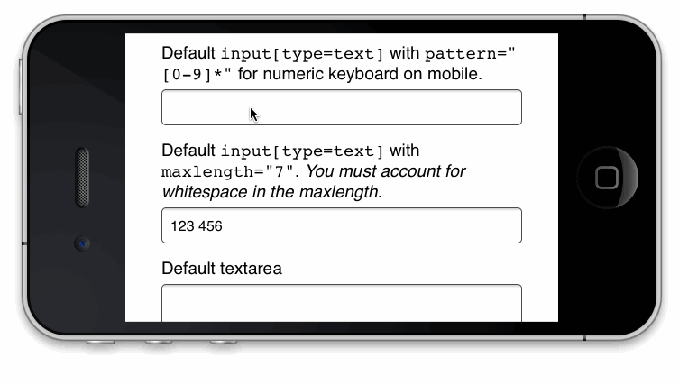

# Politespace

## Using Politespace

Add `data-politespace` to your form’s `input[type=text]` (et al) or `textarea` and we’ll add spaces to the value when the user blurs off of it. We’ll also remove those spaces on focus.

### data-grouplength

To customize the number of spaces, use the `data-grouplength` attribute (it defaults to 3). It can be:

 * single number (to uniformly repeat, like a credit card)
 * a comma delimited list (for non-uniform strings, like "2,4" for MM YYYY). This also works with open ended commas, like "2," for MM YYYY or "3,3," for a US phone number.

Use `pattern="[0-9]*"` for numeric keyboards on iOS.

This script now works reliably cross-browser with `<input type="number">`. It should be noted that independent of `politespace`, WebKit removes the value on blur when a user types or a script adds a non-numeric character in the field, for example: `myElement.value = "1,000"`. We’re now creating a proxy element on top of the form element to workaround this issue and display the formatted value.

Make sure your `maxlength` value is large enough to allow for the addition of the whitespace.

### data-delimiter

The default delimiter is a space, but you can add `data-delimiter` to customize to a different character.

### [Demo](http://filamentgroup.github.io/politespace/demo/demo.html)

### [Download politespace.js](http://filamentgroup.github.io/politespace/dist/politespace.js)

or use [Bower](http://bower.io/): `bower install politespace`

### [Tests](http://filamentgroup.github.io/politespace/test/test.html)

### Beware input masks.

This plugin was created as a less intrusive alternative to the common input mask, which have serious accessibility implications:

> A quick [screen/audio recording of tabbing around a form using JS input masks](https://docs.google.com/file/d/0B9rGmqNcHo-mRGpMS0xQbzVzeGM/edit) with VoiceOver enabled.

—[@scottjehl](https://twitter.com/scottjehl/status/317313054503211010)

> Just a friendly monthly reminder that input mask plugins make your forms sound like a jackhammer to people who use a screen reader. Cheers!

—[@scottjehl](https://twitter.com/scottjehl/statuses/317291417326206976)

## Using the repo

Run these commands:

 * `npm install`
 * `bower install`
 * `grunt` as normal

### Configuring Grunt

Rather than one giant `Gruntfile.js`, this project is using a modular Grunt setup. Each individual grunt configuration option key has its own file located in `grunt/config-lib/` (readonly upstream configs, do not modify these directly) or `grunt/config/` (project specific configs). You may use the same key in both directories, the objects are smartly combined using [Lo-Dash merge](http://lodash.com/docs#merge).

For concatenation in the previous Gruntfile setup, you’d add another key to the giant object passed into `grunt.initConfig` like this: `grunt.initConfig({ concat: { /* YOUR CONFIG */ } });`. In the new configuration, you’ll create a `grunt/config/concat.js` with `module.exports = { /* YOUR CONFIG */ };`.

## License

[MIT License](http://en.wikipedia.org/wiki/MIT_License)
